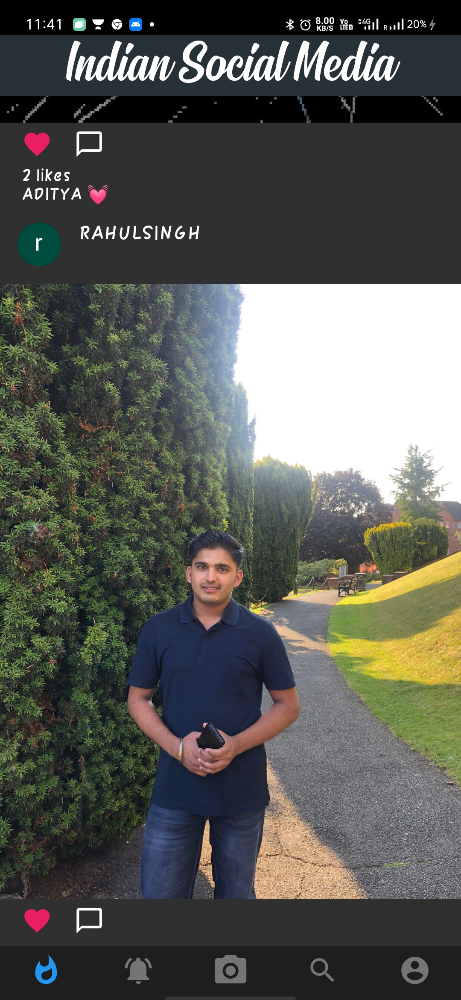
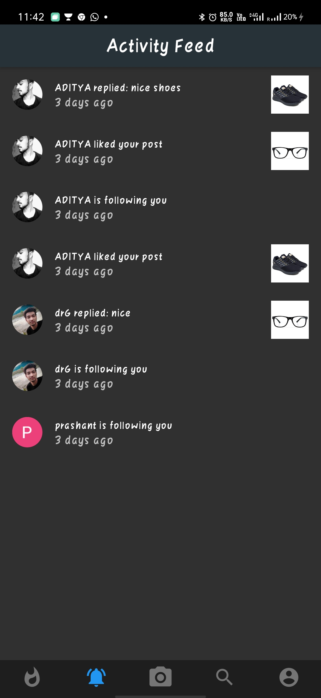
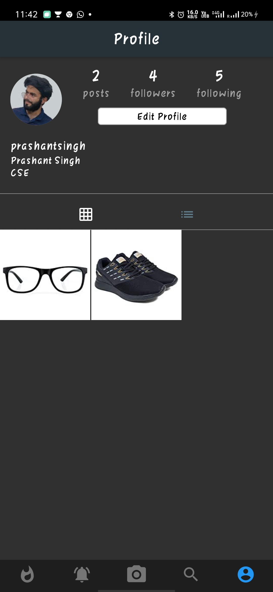
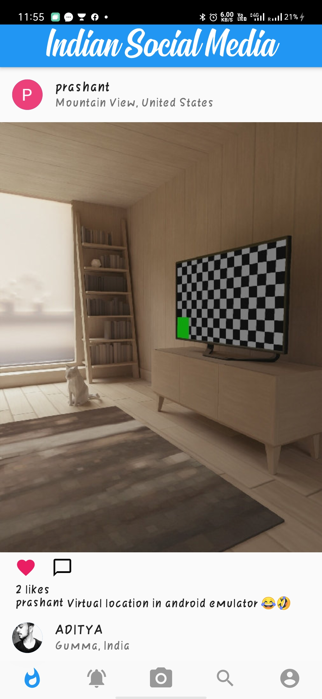
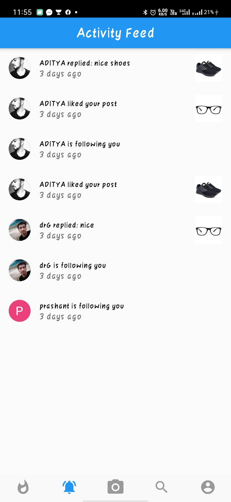
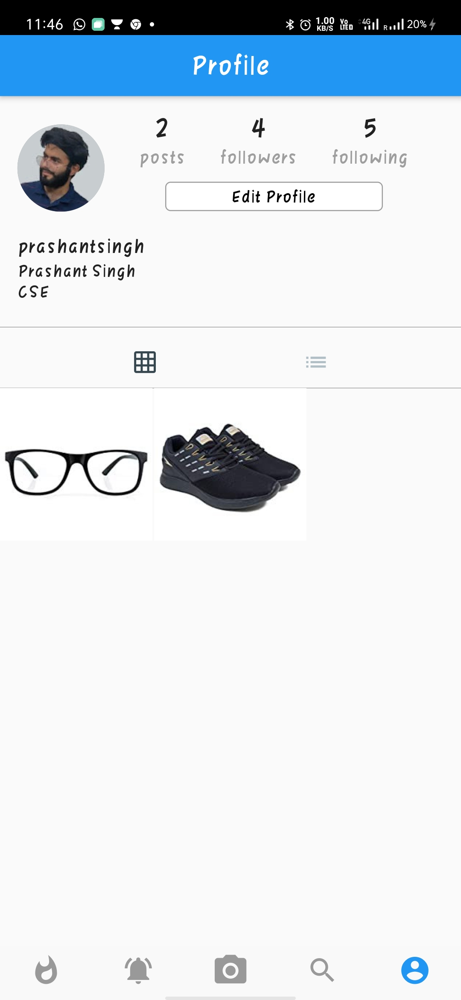

# Indian Social Media.

## What is the project?
Basically I try to clone Instagram. This app has basic funcationalities of Instagram like you can post images, comment on posts, follow others, and few more.

## How it works?
* Sign-In is done throught **firebase-authentication**
* Use **Cloud-Firestore** for storing images and comments

-----
## Screenshots 

In Dark Mode 
&ensp;&ensp;&ensp;&ensp;
In Normal Mode 
&ensp;&ensp;&ensp;&ensp;
-----
